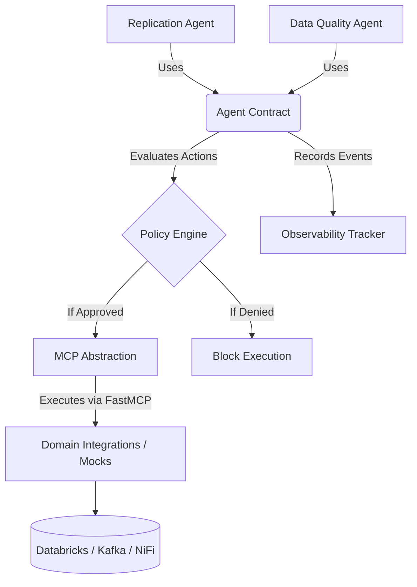

# Platform Architecture

The Data Platform Agent Engineering Platform is built on a strict separation of concerns.

## Core Layers
1. **Agent Engineering Platform (Core):** Handles Agent Contracts, LLM orchestration, Workflow/Skill management, Policy Engine, and Observability.
2. **MCP Abstraction Layer:** Bridges the core platform to external capabilities securely.
3. **Data Platform Domain:** Defines the specific models (Databases, Replication, Databricks).
4. **Integrations (Tools):** FastMCP implementations (mocks for MVP) acting against the domain.

This ensures reusability. Agents are just configurations and domain-specific logic running on the platform.

## Architecture Diagram (Mermaid)

