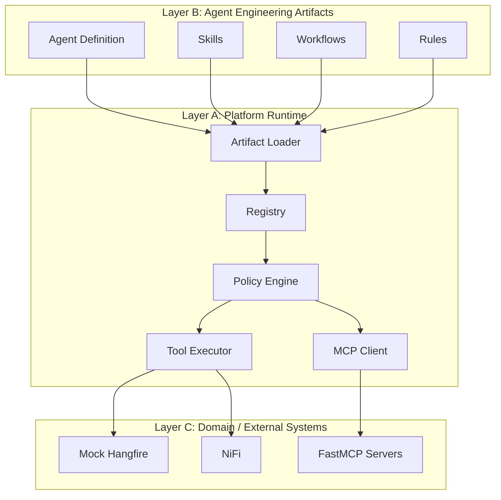

# Data Platform Agent Engineering Platform Architecture

## Introduction

This architecture establishes a Data Platform Agent Engineering Platform inspired by the organization and philosophy of Everything Claude Code (ECC). The fundamental principle is a strict separation between **What** the agent system is (Agent Engineering Artifacts) and **How** it executes (Platform Runtime).

## 1. The Three Architectural Layers

### A. Platform Runtime (The "How")
The Platform Runtime is the deterministic execution and governance layer. It is implemented in **Python**.
**Responsibilities:**
* **Artifact Loading & Registry:** Dynamically discovering, parsing, and validating explicit Agent Engineering artifacts from the repository structure.
* **Orchestration & Execution:** Bootstrapping LLM sessions, managing context windows, and executing predefined Workflows.
* **Tool & MCP Execution:** Providing the deterministic adapters and integrations to interact with the real world (via direct Python code or MCP clients/servers).
* **Policy Engine:** Enforcing strict, deterministic security rules, RBAC, and risk assessments outside of the LLM.
* **Observability & Audit:** Logging actions, context, and decisions.

*Constraint:* The Runtime MUST NOT contain hardcoded representations of Agents, Skills, or Workflows as monolithic Python classes (e.g., no `class ReplicationAgent` defining the whole agent).

### B. Agent Engineering Artifacts (The "What")
These are explicit, inspectable, version-controlled definitions that shape the AI's behavior. Based on ECC research, they are represented primarily in Markdown and YAML/JSON.
**Artifact Types:**
* **Agents (`agents/`):** Markdown files (with YAML frontmatter) defining an agent's identity, permissions, and tool access.
* **Skills (`skills/`):** Markdown files providing procedural domain knowledge and instructions for specific tasks.
* **Workflows (`workflows/`):** YAML files defining step-by-step orchestration logic.
* **Rules & Policies (`rules/`, `policies/`):** Markdown files for engineering standards and JSON/YAML for deterministic runtime security policies.
* **Tools & Hooks (`tools/`, `hooks/`):** Declarative schemas detailing inputs/outputs for capabilities the runtime will execute.
* **MCP Configuration (`mcp/`):** JSON configuration identifying approved MCP servers.

### C. Domain (The "Where")
The domain layer holds the specialized knowledge and integrations specific to Data Platform use cases.
**Responsibilities:**
* Initial focus: **Replication Monitoring & Investigation** and **Data Quality**.
* Integrations with Hangfire, NiFi, Kafka, Databricks, etc.
* Domain knowledge must reside in Domain-specific Agent Artifacts (Skills, Workflows) and specific runtime Tool integrations, never polluting the core Platform Runtime.

---

## 2. Separation of Concerns & Boundaries

* **Dependencies:** The Platform Runtime loads Agent Artifacts. Agent Artifacts reference Domain capabilities. The Domain executes via Platform Runtime tools.
* **Knowledge Boundaries:**
  * The Runtime knows *how* to parse a Markdown skill, but does *not* know what "Kafka lag" is.
  * The Policy Engine knows *who* can execute a tool, but does *not* rely on the LLM to decide if an action is safe.
  * The Agent knows *what* tools to call based on its Skills, but does *not* know how the TCP connection is formed.
* **Execution Boundary:** The LLM interprets intent, reasons about evidence, and selects tools. The Deterministic Python Runtime strictly controls tool execution, inputs, and state changes.

---

## 3. Extension Model for Future Agents

To add a new agent (e.g., Data Provisioning Agent):
1. **Create Artifacts:** Add an `agent.md` in `agents/`, write Markdown skills in `skills/`, and configure any necessary workflows in `workflows/`.
2. **Define Tools/MCP:** Expose Data Provisioning endpoints via a FastMCP server or explicit Python tool definitions.
3. **Update Policies:** Add explicit rules allowing the new Agent to access the new tools.
4. **Execution:** The core Platform Runtime executes the new agent without requiring changes to the core `orchestrator.py` or `loader.py`.

---

## 4. Architectural Validation

* **Test 1 — Remove the domain:** If all Replication-specific skills and tool implementations are deleted, the platform runtime continues to function perfectly and can load a different agent.
* **Test 2 — Add Data Quality:** A Data Quality Agent requires zero duplicated platform infrastructure; it only needs new Markdown skills and tool adapters.
* **Test 3 — Add a future Agent:** Handled entirely by composition of Artifacts, without modifying core runtime files.
* **Test 4 — Security:** The Python Policy Engine receives the LLM's requested Tool Call. The engine evaluates JSON/YAML policies and auto-rejects high-risk operations for the read-only MVP, overriding the LLM.
* **Test 5 — Runtime vs Artifact:** Python files exist *only* in `src/platform/` to execute logic (e.g., `src/platform/tool_executor.py`), not as `src/agents/replication_agent.py`.
