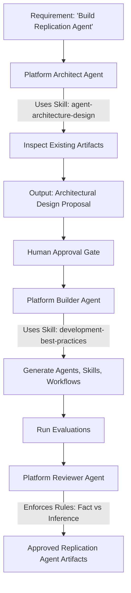

# Agent Role Architecture Review

## 1. Current-State Analysis
Currently, the repository relies on a **Generic AI Coding Harness** (e.g., Copilot, Claude) to act as a universal Platform Engineer.
*   **Combined Responsibilities:** This generic harness reads `rules/platform-engineering/artifact-evolution-and-reuse.md` and attempts to perform all 14 steps: requirements analysis, discovery, architecture design, gap analysis, developer communication, and artifact implementation.
*   **What should remain generic:** The underlying textual parsing and LLM generation.
*   **What should become specialized:** The *cognitive distinct phases*. Designing an architecture (Steps 1-10, 13) requires a completely different context and constraint set than implementing a YAML workflow or generating a Mock MCP server (Step 14).
*   **What is a Skill:** `agent-architecture-design.md` is currently a Skill. It provides procedural guidance on *how* to draft a proposal.
*   **Ambiguity:** The platform relies heavily on the human developer (Step 14) as the orchestrator/approver to transition the AI from "Architect" to "Builder".

## 2. Optimization and Self-Critique Loop History

### Iteration 1: The Kitchen Sink
*   *Proposed Agents:* Requirements Analyst, Agent Architect, Agent Builder, Agent Evaluator, Factory Orchestrator.
*   *Critique:* Five agents are too many. The "Requirements Analyst" and "Agent Architect" completely overlap (Steps 1-10). The "Factory Orchestrator" introduces severe Harness Lock-in—how does a generic Copilot instance "call" the Factory Orchestrator? It can't easily without a Phase 4 universal runtime.
*   *Adjustment:* Merge Analyst and Architect into **Platform Architect Agent**. Discard Factory Orchestrator in favor of Harness-driven orchestration (Option A).

### Iteration 2: Factory Orchestrator vs. Harness Orchestration
*   *Option A (Harness Orchestration):* The AI coding harness reads a standard workflow and switches its own system prompt (Role) based on the stage.
*   *Option B (Factory Orchestrator Agent):* An explicit agent delegates tasks.
*   *Critique:* Option B violates portability. If a developer uses GitHub Copilot, Copilot cannot natively spin up sub-agents without a custom Python runtime (Phase 4). Option A is highly portable but risks the generic harness forgetting its role.
*   *Adjustment:* We will define specialized Agent roles as distinct *artifacts* (`agents/platform-architect.md`, `agents/platform-builder.md`). The Harness simply *assumes* these identities sequentially via a Workflow, preserving Option A's portability.

### Iteration 3: Final Convergence & Boundary Testing
*   *Proposed Set:* **Platform Architect Agent**, **Platform Builder Agent**, **Platform Reviewer Agent**.
*   *Test A (Replication):* Can this build the Replication Agent? Yes. Architect designs it, Builder writes the YAML/MD, Reviewer ensures Fact vs Inference rules are met.
*   *Test B (Data Quality):* Yes, Architect easily identifies missing SQL tools.
*   *Test E (Fresh AI):* A fresh AI simply reads `platform-engineering-workflow.yaml` which says: "Assume Architect role -> Output Design -> Wait for Human -> Assume Builder role -> Output Files". This is universally portable.
*   *Critique:* Is "Evaluator" an agent? No, Evaluation is an *activity* (a Workflow step) where the Builder/Reviewer runs the `evaluations/*.yaml` tests.

## 3. Minimum Viable Agent Set
The minimum coherent set is **Three (3)** specialized Platform Agents:
1.  **Platform Architect Agent:** Translates requirements into an artifact design, identifies gaps (REUSE vs NEW), and proposes architecture.
2.  **Platform Builder Agent:** Generates the actual Markdown, YAML, and JSON artifacts strictly based on the Architect's approved design.
3.  **Platform Reviewer Agent:** Audits the Builder's output against repository Rules (e.g., Fact vs Inference, Read-Only Policy) before final commit.

*Why minimal?*
*   Merging Architect and Builder causes the AI to write code before finishing the design (premature implementation).
*   Merging Builder and Reviewer removes the adversarial self-correction loop required for high-quality generation.
*   Any further splitting (e.g., a "Tester Agent") turns activities into unnecessary personas.

## 4. Factory Orchestrator Analysis
**Recommendation: Option A (No Orchestrator Agent).**
*   *Reasoning:* An explicit Orchestrator Agent creates an unnecessary runtime dependency. It requires a Phase 4 engine to handle inter-agent communication. By leaving orchestration to the AI Coding Harness (following a declarative `platform-engineering-workflow.yaml`), we guarantee extreme portability across Copilot, Claude, Codex, and Gemini.

## 5. Skills vs Agents
*   **Disguised Agent:** The 14-step process in `rules/platform-engineering/artifact-evolution-and-reuse.md` is currently acting as a monolithic, disguised Agent. It should be split into distinct workflows for the Architect and Builder.
*   **Disguised Skill:** "Agent Evaluator" is a disguised skill/activity. Running tests (`pytest` or parsing `evaluations/`) is a procedural action the Builder/Reviewer takes, not a distinct autonomous persona.

## 6. 14-Step Lifecycle Mapping

| Step | Current Purpose | Recommended Owner | Artifact Type | Why |
| :--- | :--- | :--- | :--- | :--- |
| 1-7 | Understand & Inspect Repo | Platform Architect Agent | Agent Responsibility | Requires deep analytical context, not file writing. |
| 8-10 | Gap Analysis (REUSE/NEW) | Platform Architect Agent | Agent Responsibility | Core architectural decision making. |
| 11-12 | Identify Missing Info & Ask | Platform Architect Agent | Agent Responsibility | Human-in-the-loop requirement gathering. |
| 13 | Propose Architecture | Platform Architect Agent | Agent Output | The concrete artifact passed to the human/Builder. |
| 14.a | Wait for Approval | Human / Harness | Workflow Boundary | Strict authorization gate. |
| 14.b | Implement Changes | Platform Builder Agent | Agent Responsibility | Focused solely on writing syntactically correct artifacts. |
| 14.c | Evaluate/Test | Platform Builder Agent | Workflow Activity | Builder verifies its own work against `evaluations/`. |
| 14.d | Review | Platform Reviewer Agent | Agent Responsibility | Adversarial check against repository Rules. |

*Note: Steps 14.c and 14.d are newly mapped to fix missing responsibilities in the original 14-step list.*

## 7. End-to-End Example: Replication Incident Investigation Agent

## 8. Data Platform Specialization
*   **Baseline / Platform-Wide:** The 3 Platform Agents (Architect, Builder, Reviewer) and their procedural skills (`agent-architecture-design`). These live in the Platform Engineering Layer and know *nothing* about Replication or Data Quality natively.
*   **Domain-Specific:** The Replication Agent, `analyze-kafka-lag`, Data Quality schemas. These live in the Domain Agent Layer. The Platform Architect simply *reads* them to determine if they can be reused.

## 9. Harness Independence
This multi-agent architecture is fully harness-independent. Because the agents are just Markdown definitions, a Copilot user can simply type: *"Act as the Platform Architect and evaluate this requirement."* Once approved, the user types: *"Now act as the Platform Builder and implement your design."* No Python orchestration runtime is required for this to function beautifully.

## 10. Architecture Risks & Mitigations
*   *Risk:* Vendor Lock-in (requiring a custom UI to switch agents).
    *   *Mitigation:* Define the agents as simple Markdown personas. The human user manages the state transition in standard chat interfaces (Option A).
*   *Risk:* Premature Phase 4 Implementation.
    *   *Mitigation:* The output of the Builder Agent is strictly `.md`, `.yaml`, and `.json`. The Builder is governed by a strict Rule forbidding Python framework creation.
*   *Risk:* Agents becoming disguised Skills.
    *   *Mitigation:* Ensure Agents have distinct outputs. (Architect outputs a Design Doc. Builder outputs Repo Files. Reviewer outputs an Audit Report).

## 11. Final Recommendation

**Proposed Agent Roles:**
1.  **Platform Architect Agent (NEW):** Responsible for analyzing requirements, inspecting the repo, determining REUSE/NEW, and proposing the artifact design. Uses `agent-architecture-design` Skill.
2.  **Platform Builder Agent (NEW):** Responsible for generating the artifacts. Uses `development-best-practices` and `mcp-development` Skills.
3.  **Platform Reviewer Agent (NEW):** Responsible for auditing artifacts against `rules/` (e.g., Fact vs Inference, Read-Only constraints).

**Workflows:**
*   **platform-engineering-workflow (NEW):** Connects the Architect -> Human -> Builder -> Reviewer in a declarative sequence.

**Conclusion:**
The platform must transition from relying on a monolithic "Generic AI" to a sequence of three specialized Engineering Agents. This enforces a strict separation between *designing* an architecture and *writing* the files, minimizing hallucinations and architectural drift, while remaining completely independent of any specific Phase 4 Python runtime or LLM vendor.
